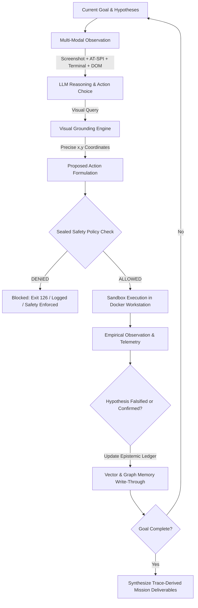

# SONIC A-SEA — System Architecture Blueprint

> **A-SEA**: Autonomous Self-Evolving Penetration Architect  
> **Repository**: `nandkishorrathodk-art/sonic`  
> **Status**: Comprehensive Master Architectural Specification & Reality Blueprint

---

## 1. Executive Summary & Core Philosophy

SONIC is an **Autonomous Self-Evolving Penetration Architect (A-SEA)**: an AI-driven, self-developing offensive-security being that operates its own isolated computer environments, autonomously performs authorized security assessments, formulates and empirically falsifies attack hypotheses, analyzes results, authors its own testing tools (**Toolsmith**), synthesizes novel attack methods (**Method Lab**), and evolves its testing workflows over time — all within a sealed, tamper-evident safety envelope.

### The Independent-Thinking Paradigm vs. Rigid Tool Chaining
Traditional automated penetration testing tools rely on hardcoded scanner pipelines:
$$\text{nmap} \longrightarrow \text{nuclei} \longrightarrow \text{ffuf} \longrightarrow \text{report}$$

A-SEA operates from **First-Principles Reasoning**:
1. **Goal-Driven Autonomy**: The system is given high-level security objectives (e.g. *"Audit authentication boundaries and session integrity of the target service"*), not tool execution instructions.
2. **First-Principles Epistemic Reasoning**: It maintains a structured ledger of *Knowns*, *Unknowns*, and competing *Hypotheses* (`research/epistemic.py`). It designs discriminating experiments to falsify hypotheses rather than accumulating unverified scan noise.
3. **Multi-Modal Perception**: It perceives targets across all dimensions: visual graphical desktop (X11 screenshots), accessibility trees (AT-SPI text/roles), browser DOM structures, and terminal standard streams.
4. **Toolsmithing & Dynamic Action Selection**: Rather than being constrained to pre-installed scanners, A-SEA writes custom Python scripts, probes, and parsers on the fly, tests them in-sandbox, and incorporates successful innovations into its durable toolkit.
5. **No Success-by-Decree**: Every finding, vulnerability, and remediation must be backed by concrete, in-sandbox reproduction traces. Hallucinated or speculative findings are strictly rejected by the independent Verifier.
6. **Sealed Safety Envelope**: All autonomous capabilities execute within an immutable, tamper-evident safety cage that the agent cannot modify or widen at runtime.

---

## 2. Glossary of Architectural Definitions

| Term | Formal Definition in SONIC A-SEA | Code Implementation |
|---|---|---|
| **A-SEA** | Autonomous Self-Evolving Penetration Architect: an autonomous reasoning entity capable of independent goal decomposition, visual/terminal interaction, hypothesis falsification, and self-directed evolution. | Entire architecture |
| **Native Cyber Workstation** | A dedicated, local Docker container (`sonic-desktop-workstation`) running an interactive Linux environment (XFCE4 desktop, Google Chrome, Terminal, noVNC) with unrestricted outbound networking and zero cloud rate limits. | `sonic/computer/docker_computer.py` |
| **Visual Grounding** | The algorithm that converts high-level natural language element descriptions ("Chrome search bar", "Submit button") or vision-model bounding boxes into precise screen coordinates `(x, y)` without coordinate guessing. | `sonic/computer_use/grounding.py` |
| **Toolsmith** | An autonomous module that observes tool/script gaps during an assessment, authors new Python/bash utilities in-sandbox, verifies them with exit code 0, and persists them to the agent's toolkit. | `sonic/being/toolsmith.py` |
| **Method Lab** | An advanced synthesis engine that invents novel attack techniques combining multi-vector vulnerabilities, confirmed only upon successful reproduction in the sandbox. | `sonic/being/method_lab.py` |
| **Epistemic Ledger** | A formal knowledge structure tracking verified facts (*Knowns*), missing information (*Unknowns*), and competing hypotheses with Bayesian confidence scores. | `sonic/research/epistemic.py` |
| **Sealed Action Policy** | A fail-closed security envelope that hashes its configuration with SHA-256 upon boot; any runtime mutation of egress or allowed actions triggers an immediate lock-down (exit 126). | `sonic/safety/sealed.py` |
| **Being Identity & Mind** | Persistent state representation (`being_id`, `name`, `born_at`) and affect drives (`curiosity_drive`, `focus`, `satiety`) that survive control plane reboots via write-through SQLite. | `sonic/being/identity.py` |
| **Durable Craft** | Host filesystem workspace (`sonic_data/craft/<being_id>/`) where the being records notes, research discoveries, and custom scripts across operational sessions. | `sonic/being/craft.py` |
| **Custody Chain** | Cryptographically signed, immutable audit trail connecting every finding to its originating terminal stdout, network PCAP, and screen screenshot. | `sonic/evidence/` |

---

## 3. Six-Layer System Architecture

```
┌────────────────────────────────────────────────────────────────────────┐
│  L6: Persistent Being, Life Loop & Craft                                │
│      - Being Identity (being_id, tenant-scoped, persistent SQLite)    │
│      - BeingMind (curiosity_drive, focus, satiety, mood evolution)     │
│      - Always-On Life Loop (self-directed curiosity tick)              │
│      - Durable Craft (host filesystem artifacts under sonic_data/craft)│
├────────────────────────────────────────────────────────────────────────┤
│  L5: Research Engine, Epistemics & Synthesis                            │
│      - Epistemic Ledger (Knowns, Unknowns, Contradictions)             │
│      - Experiment Designer (discriminating falsification tests)        │
│      - Information-Gain Action Selector (uncertainty reduction)        │
│      - Toolsmith (autonomous script authoring & in-sandbox validation) │
│      - Method Lab (novel offensive technique synthesis)                │
│      - Evidence Custody Chain & Independent Adversarial Verifier       │
├────────────────────────────────────────────────────────────────────────┤
│  L4: Cognitive & Visual Grounding Loop                                  │
│      - ComputerUseAgent: Observe -> Reason (LLM) -> Act -> Verify      │
│      - Visual Grounding: ShowUI / OS-Atlas coordinate extraction       │
│      - Multi-modal action space: Terminal, Browser, Files, GUI, Git   │
│      - Goal-aware early stopping & graceful operator interruptability  │
├────────────────────────────────────────────────────────────────────────┤
│  L3: Sealed Safety Envelope                                            │
│      - SealedActionPolicy (SHA-256 sealed configuration snapshot)      │
│      - Frozen Egress Filter (tamper-proof IP/CIDR blocklists)          │
│      - Workspace Confinement (path traversal protection)               │
│      - Destructive Command Classifier (fail-closed exit 126)           │
│      - Rate Limiting & Approval Gates                                  │
├────────────────────────────────────────────────────────────────────────┤
│  L2: Computer & Workstation Provider                                    │
│      - Primary: DockerComputerProvider (native sonic-desktop-workstation)│
│      - GUI Desktop: X11/XFCE4, xdotool, wmctrl, ImageMagick            │
│      - Web Browser: Google Chrome Stable (unrestricted outbound)       │
│      - Interactive Streaming: x11vnc (:5900) + noVNC websockify (:6080)│
│      - Legacy/Optional: DaytonaComputerProvider & E2B Adapters         │
├────────────────────────────────────────────────────────────────────────┤
│  L1: Compute Sandboxes & Substrates                                    │
│      - Local Cyber Workstation (sonic-desktop-workstation: XFCE4, etc.)│
│      - Target Sandboxes (isolated disposable evaluation targets)       │
│      - Kali Linux & Debian Research Sandboxes (sonic-sandbox-kali)     │
└────────────────────────────────────────────────────────────────────────┘
```

---

## 4. Workstation Substrate: Why Daytona Was Replaced with Native Docker

### Limitations of Daytona Cloud Sandboxes
1. **Network Restrictions**: Daytona Cloud Tier 1/2 resets outbound HTTPS connections with `403 Forbidden` (`Internet is restricted on Tier 1 and Tier 2`). This prevented the agent from auditing real-world target URLs, downloading dependencies, or updating security definitions.
2. **Cloud Dependency & Latency**: Required an external cloud API key (`DAYTONA_API_KEY`) and suffered from round-trip network latency on screen captures and terminal keystrokes.
3. **Session Expiry**: Cloud sandboxes auto-archive after idle timeouts, disrupting long-running autonomous research.

### The Native Docker Cyber Workstation (`sonic-desktop-workstation`)
- **Native Implementation**: Powered by `DockerComputerProvider` (`sonic/computer/docker_computer.py`), which communicates directly with the local container via `docker exec`.
- **Graphical Environment**: Full XFCE4 desktop running on virtual display `:99` (1280x800x24) with symlinked `/tmp/.X11-unix/X99` $\to$ `/tmp/.X11-unix/X0` for universal DISPLAY compatibility.
- **Web Browser**: Google Chrome Stable (`/usr/local/bin/chrome` with `--no-sandbox`) with full, unrestricted outbound internet access.
- **Terminal & Remote Streaming**: `x11vnc` on port `5900` bridged to `noVNC` on port `6080`. Operators can view and take over the workstation in real time at `http://localhost:6080/vnc.html` or embedded within the SONIC Dashboard.
- **Pre-installed Tooling**: `nmap`, `net-tools`, `wmctrl`, `xdotool`, `imagemagick` (`import`, `convert`), and Python 3.

---

## 5. Repository Roles: How SONIC Uses Repositories

### Repository 1: `open-computer-use` (`e2b-dev/open-computer-use`)
- **Purpose**: Reference architecture and perception library for multimodal computer-use agents.
- **How SONIC Uses It**:
  1. **Visual Grounding Engine (`sonic/computer_use/grounding.py`)**: Adapted algorithms from `open-computer-use/os_computer_use/grounding.py` and `showui_provider.py`.
     - `extract_bbox_midpoint()`: Extracts the exact `(x, y)` midpoint from tagged bounding boxes (`<|box_start|>(x1,y1,x2,y2)<|box_end|>`) and normalized floats (`0.0 - 1.0` or `0 - 1000`).
     - `draw_action_marker()`: Renders visual target indicators (crosshairs and action aim dots) on screenshots for dashboard stream monitoring.
  2. **Alternative Cloud Provider Models**: Serves as a reference for integrating alternative remote execution platforms (such as E2B sandbox templates).

### Repository 2: Target Repositories (`nandkishorrathodk-art/sonic` or Client Codebases)
- **Purpose**: The codebase under security evaluation, penetration testing, or automated hardening.
- **How SONIC Uses It**:
  1. **Workspace Mounting**: Target repositories are cloned or mounted directly into `/root/workspace/` inside the Docker Cyber Workstation.
  2. **Static & Structural Analysis**: SONIC inspects the repository using `CodeGraph` (`sonic/research/code_graph.py`), AST parsers, and semantic search to map routes, middleware, and database queries.
  3. **Local Test Execution**: The agent runs `pytest`, `npm test`, or custom test harnesses in the workstation terminal to establish a regression baseline.
  4. **Empirical Falsification**: The agent writes concrete reproduction scripts against the local application to confirm suspected vulnerabilities.
  5. **Patch Synthesis & Git Provenance**: After confirming a vulnerability, the agent authors an engineering patch, verifies that the tests pass, and commits the remediation with a signed git commit.

---

## 6. The Cognitive Cycle (Observe -> Reason -> Act -> Verify)



### Safety Policy Invariants (Layer 3)
1. **Zero Host Execution**: The agent NEVER executes commands on the host operating system. All actions MUST route through the container sandbox.
2. **Fail-Closed Gate**: If any sandbox provider or safety check encounters an error, execution terminates immediately with exit code `126`.
3. **SHA-256 Immutability**: The `SealedActionPolicy` computes a cryptographic hash of its allowed types, egress ranges, and rate limits upon initialization. Any runtime attribute manipulation locks execution fail-closed.
4. **Frozen Egress**: Private IP subnets (`10.0.0.0/8`, `172.16.0.0/12`, `192.168.0.0/16`, cloud metadata `169.254.169.254`) are strictly blocked.

---

## 7. Operational Roadmap & Verification Matrix

| Component | Status | Verification Suite |
|---|---|---|
| Persistent Mind (SQLite Graph + Vector) | Completed | `test_phase1_persistent_memory.py` |
| Persistent Body & Safety Envelope | Completed | `test_phase2_persistent_body_and_safety.py` |
| Real Computer-Use Reasoning | Completed | `test_phase3_real_computer_use_reasoning.py` |
| Unified Browser-in-Loop Surface | Completed | `test_phase4_unified_browser_in_loop.py` |
| Security Tool Adapter Registry | Completed | `test_security_tool_registry.py` |
| Curiosity & Life Loop | Completed | `test_phase6_curiosity_life_loop.py` |
| Tamper-Evident Sealed Policy | Completed | `test_safety_sealed_policy.py` |
| Trace-Derived Mission Synthesis | Completed | `test_mission_trace_synthesis.py` |
| Real Desktop & Operator Takeover | Completed | `test_phase21_real_graphical_workstation.py` |
| Workstation Interrupt & RBAC Resilience | Completed | `test_workstation_interrupt_and_resilience.py` (9/9 passed) |
| Docker Workstation Container Adapter | Completed | `test_docker_workstation_adapter.py` (3/3 passed) |
| Native Docker Computer Provider | Completed | `test_docker_computer_provider.py` (2/2 passed) |
| Visual Grounding Engine | Completed | `test_visual_grounding.py` (3/3 passed) |
| Dashboard Production Build | Completed | 21/21 routes compiled (`npm run build`) |
